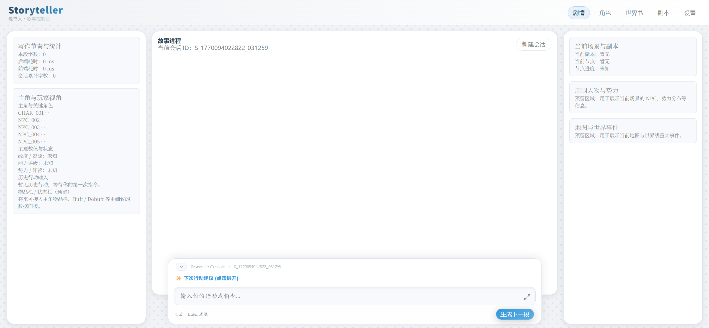
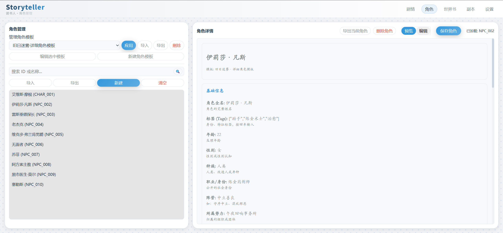
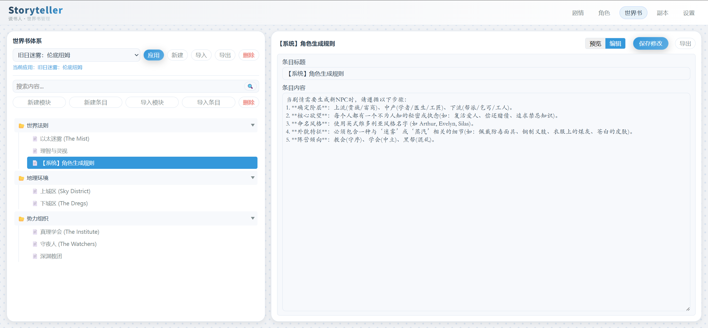
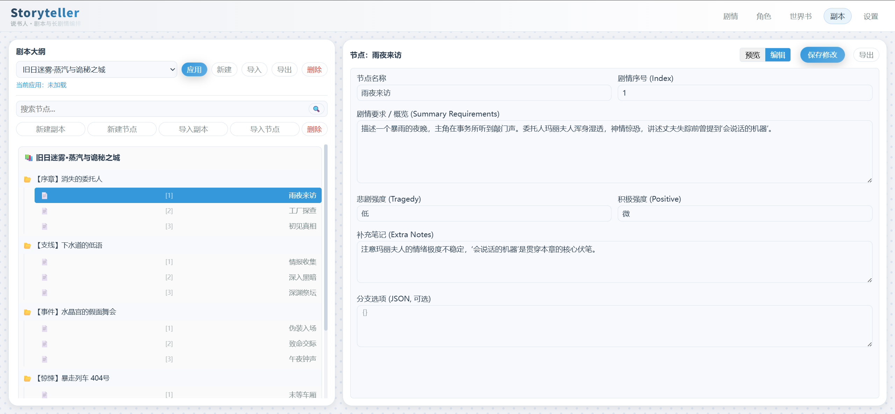
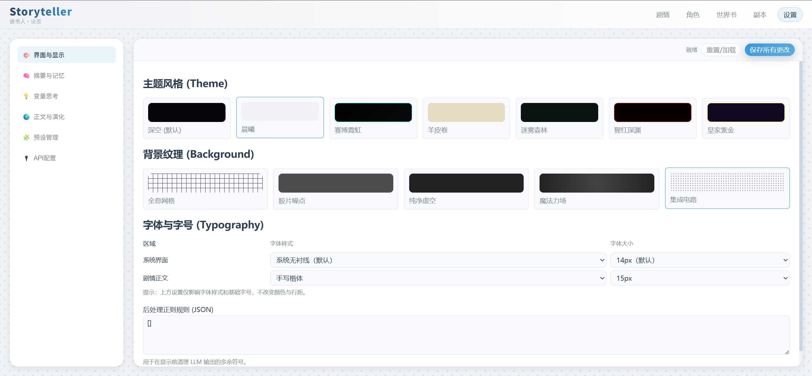

# 📖 互动式小说生成系统——“说书人”项目 (Storyteller)

**本项目是一个基于 **FastAPI** + **SQLite** + **原生前端** 构建的互动小说/RPG 游戏引擎原型。其核心目标是构建一个能够承载大语言模型 (LLM) 的基础架构，并提供高度可配置的**动态角色模板系统。

## 📥 安装与运行

1. **安装依赖**：
   **Bash**

   ```
   pip install -r requirements.txt
   ```
2. **启动服务**：
   **Bash**

   ```
   python -m backend.main
   ```

   或

   ```
   uvicorn backend.main:app --reload --port 8010
   ```
3. **访问地址**：

   * 主界面：`http://localhost:8010`

---

## 界面图片

剧情界面（主界面）



角色界面



世界书界面



副本（剧本）界面



设置界面



---

## 🚀项目开发

### 1. 项目核心概览

本项目名为 **Storyteller (说书人)**，是一个基于大语言模型 (LLM) 驱动的沉浸式叙事与 RPG 游戏编排引擎。

* **项目名称与定位**：本系统定位于一款模块化的 AI 辅助创作工具，旨在通过 RAG (检索增强生成) 和状态追踪技术，将传统跑团 (TRPG) 的复杂逻辑转化为 AI 可感知的结构化上下文。
* **技术栈选择**：
  * **后端**：基于 **FastAPI** 异步框架，利用 SQLAlchemy 进行数据持久化。
  * **数据库**：采用 **SQLite** 作为轻量级存储方案，托管剧情记录、角色数据及系统配置。
  * **前端**：暂时使用**原生 Web 技术栈 (HTML/JS/CSS)**，通过 CSS 变量驱动多主题引擎，实现零框架依赖的高性能交互。
* **核心架构模型**：
  * **编排引擎 (Orchestrator)**：协调玩家行动、历史记忆与世界观背景，动态组装提示词并调用 OpenAI 兼容接口。
  * **提示词树 (Prompt Tree)**：首创结构化提示词管理，支持节点的递归注入、锁定与触发逻辑。
  * **角色协议 (UCP)**：遵循通用角色协议规范，实现了从“硬编码字段”到“动态模板驱动”的彻底转型。
* **当前成熟度**：
  * **基础建设**：已完成多实例 LLM 配置管理、流式输出响应、以及基于会话的状态保持功能。
  * **模块化深度**：世界书 (Worldbook) 的层级化管理与剧本节点 (Dungeon Node) 的流程编排已实现闭环。
  * **视觉与交互**：具备 7 套预设主题及 5 种背景纹理，支持全屏写作与半屏控制台模式的无缝切换。

---

### 2. 项目目录结构

根据项目实际文件布局，整体结构如下：

**Plaintext**

```
Storyteller/
├── backend/                        # 后端核心：基于 Python/FastAPI 的业务逻辑│   
│   ├── api/                        # API 接口层：定义前端调用的 RESTful 接口
│   │   ├── __init__.py             # 路由模块初始化
│   │   ├── routes_characters.py    # 角色管理接口（CRUD、模板应用）
│   │   ├── routes_dungeon.py       # 剧本/副本节点流转接口
│   │   ├── routes_llm.py           # LLM 配置与模型列表获取接口
│   │   ├── routes_presets.py       # 提示词预设管理接口
│   │   ├── routes_settings.py      # 全局系统设置接口
│   │   ├── routes_story.py         # 核心剧情生成与会话接口
│   │   ├── routes_templates.py     # 角色渲染模板接口
│   │   └── routes_worldbook.py     # 世界书条目与分类接口
│   ├── core/                       # 核心逻辑层：底层功能实现
│   │   ├── __init__.py             # 核心包初始化
│   │   ├── embeddings.py           # 文本向量化处理，支持语义检索
│   │   ├── evolution.py            # 世界演化逻辑，处理 NPC 状态变更
│   │   ├── llm_client.py           # 统一 LLM 客户端，封装流式输出逻辑
│   │   ├── orchestrator.py         # 叙事编排器，协调 Prompt 组合与生成
│   │   ├── prompts.py              # Prompt 加载器，管理动态注入逻辑
│   │   ├── rag.py                  # RAG 检索逻辑，从世界书提取背景
│   │   ├── storage.py              # 内存/临时存储管理
│   │   ├── summary.py              # 剧情自动摘要生成逻辑
│   │   ├── text_opt.py             # 文本优化与文笔润色逻辑
│   │   └── variables.py            # 数值变量思考与追踪逻辑
│   ├── db/                         # 数据库层：数据持久化
│   │   ├── crud/                   # 封装各实体的增删改查操作
│   │   │   ├── __init__.py         # CRUD 初始化
│   │   │   ├── characters.py       # 角色数据库操作
│   │   │   ├── dungeons.py         # 剧本数据操作
│   │   │   ├── settings.py         # 系统设置数据操作
│   │   │   ├── story.py            # 剧情记录数据库操作
│   │   │   └── worldbook.py        # 世界书数据库操作
│   │   ├── __init__.py             # 数据库模块初始化
│   │   ├── base.py                 # SQLAlchemy 基础类与引擎配置
│   │   └── models.py               # 数据库表模型定义
│   ├── prompts/                    # 静态提示词预设 (JSON 格式)
│   │   ├── story_generation.json   # 剧情生成的主系统 Prompt
│   │   └── variable_thinking.json  # 变量逻辑分析 Prompt
│   ├── static/                     # 后端静态资源管理
│   │   ├── maps/                   # 存放世界/副本相关地图素材
│   │   ├── __init__.py             # 初始化
│   │   ├── config.py               # 后端静态配置项
│   │   ├── main.py                 # 静态资源服务入口逻辑
│   │   └── mapping_config.json     # 静态资源与逻辑的映射表
│   └── main.py                     # 后端入口：启动 FastAPI 服务
├── data/                           # 数据存储区
│   ├── worldbook_import/           # 外部世界书导入暂存区
│   └── db.sqlite                   # SQLite 数据库文件
├── frontend/                       # 前端界面：纯原生 Web 开发
│   ├── assets/                     # 静态资源
│   │   ├── css/
│   │   │   └── style.css           # 全局样式方案，包含主题引擎
│   │   └── js/
│   │       ├── characters.js       # 角色编辑与模板设计逻辑
│   │       ├── dungeon.js          # 剧本编排与节点控制逻辑
│   │       ├── main.js             # 首页故事进程与实时交互逻辑
│   │       ├── settings.js         # 设置页表单处理与 API 配置逻辑
│   │       ├── theme-init.js       # 主题与字体配置的首屏初始化
│   │       └── worldbook.js        # 世界书树状管理逻辑
│   ├── characters.html             # 角色管理页面
│   ├── dungeon.html                # 副本/剧本页面
│   ├── index.html                  # 叙事控制台主页面
│   ├── settings.html               # 全局设置页面
│   └── worldbook.html              # 世界书管理页面
├── .env                            # 环境配置文件（敏感 Key 等）
├── README.md                       # 项目说明文档
├── requirements.txt                # Python 依赖包列表
└── Universal_Character_Protocol.txt # 通用角色协议规范文档
```

---

### 3. 文件职责说明

#### A、 项目入口与环境配置

项目根目录包含启动服务及定义运行环境的关键文件。

* **`main.py` (后端入口)**：启动 FastAPI 异步 Web 服务器的主入口文件。
* **`.env`**：存储敏感配置，如 API 密钥、数据库连接字符串等环境变量。
* **`requirements.txt`**：列出项目运行所需的全部 Python 第三方库依赖。
* **`Universal_Character_Protocol.txt`**：定义了不同模块间交换角色数据的通用标准协议，确保系统各部分数据兼容。
* **`README.md`**：项目的使用手册，包含安装指南、功能描述及开发文档。

---

#### B、 后端核心架构 (Backend)

##### 1. API 路由层 (`backend/api/`)

负责接收前端 HTTP 请求，并将任务分发给核心逻辑层。


| **文件名**                 | **详细职责描述**                                                   |
| -------------------------- | ------------------------------------------------------------------ |
| **`routes_story.py`**      | 核心叙事接口，处理剧情生成请求、会话上下文同步及历史记录检索。     |
| **`routes_characters.py`** | 角色库的 CRUD（增删改查）管理，支持角色的批量导入与模板应用。      |
| **`routes_worldbook.py`**  | 世界书设定的层级管理，提供条目检索及分类配置的读写服务。           |
| **`routes_llm.py`**        | 模型中心接口，负责 LLM 配置的增删改查以及可用模型列表的实时检索。  |
| **`routes_dungeon.py`**    | 剧本流程控制，管理线性或分支剧情节点的进度与逻辑跳转。             |
| **`routes_settings.py`**   | 全局偏好设置接口，包括 UI 界面配置、RAG 策略及自动摘要频率等。     |
| **`routes_presets.py`**    | 提示词预设管理，允许在不同预设（如 DM 风格、作家风格）间快速切换。 |
| **`routes_templates.py`**  | 角色渲染模板接口，负责定义不同角色的 UI 显示字段与路径映射。       |

##### 2. 核心逻辑层 (`backend/core/`)

项目的“大脑”，负责处理复杂的生成逻辑与状态模拟。

* **`orchestrator.py` (编排器)**：核心调度者，负责将角色设定、世界观、历史记忆与用户行动组合成最终的 Prompt 并分发任务。
* **`llm_client.py` (模型客户端)**：统一的模型交互层，屏蔽了不同厂商 API 的差异，支持流式 (Streaming) 输出。
* **`prompts.py` (提示词引擎)**：负责从磁盘加载 JSON 格式的 Prompt 模板，并根据当前语境执行动态变量注入。
* **`rag.py` (检索增强)**：基于语义相似度从世界书中提取背景知识，为 AI 生成提供事实支撑。
* **`summary.py` (摘要算法)**：定期对冗长的对话历史进行语义压缩，防止长文本超过模型的 Token 限制。
* **`variables.py` (数值思考)**：逻辑处理 NPC 或主角的属性波动（如 HP、经济值），确保剧情中的数值符合逻辑。
* **`evolution.py` (演化机制)**：模拟非玩家视角下的世界变动，使 NPC 和场景能够随着时间推移自动更迭状态。
* **`embeddings.py`**：将文本转化为高维向量，为 RAG 检索提供计算基础。
* **`storage.py`**：管理后端临时数据的持久化与内存缓存，优化系统响应速度。

##### 3. 数据库与持久化 (`backend/db/`)

* **`models.py`**：使用 SQLAlchemy 定义的数据库表模型，包括角色、会话、世界书及设置的物理结构。
* **`base.py`**：数据库连接池与会话管理配置，确保数据库访问的稳定性。
* **`crud/` 目录**：包含了针对每个业务实体（角色、剧本、设置等）的具体底层数据库操作函数。

---

#### C、 前端展示层 (Frontend)

##### 1. 页面骨架 (HTML)

* **`index.html`**：主叙事终端，包含打字机效果的故事输出流和交互输入区。
* **`characters.html`**：角色实验室，提供可视化设计器来定义角色的属性字段与标签。
* **`worldbook.html`**：世界观浏览器，采用树状结构管理分类与条目。
* **`dungeon.html`**：剧本大纲编辑器，用于编排副本的节点顺序与剧情要求。
* **`settings.html`**：系统配置面板，包含 UI 主题、字体及 API 密钥的图形化调整。

##### 2. 交互逻辑脚本 (`frontend/assets/js/`)

* **`main.js`**：管理首页的核心会话流，处理用户输入提交，实时更新侧边栏的统计数据和场景信息。
* **`characters.js`**：实现高度灵活的动态表单，根据不同的模板 ID 自动渲染对应的 UI 组件（如滑块、属性图）。
* **`worldbook.js`**：处理世界书的层级交互，支持条目的即时搜索、树节点的展开与收起。
* **`dungeon.js`**：负责剧本节点的管理，实现剧本的预览与编辑模式切换。
* **`settings.js`**：处理全局配置的保存与加载，包括 LLM 配置的检索与模型列表更新。
* **`theme-init.js`**：**首屏关键脚本**。在页面渲染前读取存储并应用主题，防止视觉上的白色闪烁。

##### 3. 样式引擎 (`frontend/assets/css/`)

* **`style.css`**：定义了整个项目的设计系统。包含 7 套主题（深空、晨曦、赛博等）和 5 种背景纹理（网格、噪点等），通过 CSS 变量驱动全站视觉。

---

#### D、 静态资源与数据存储

* **`backend/static/`**：存放后端直接服务的静态资源。
  * **`mapping_config.json`**：定义逻辑模块与大模型/提示词的映射规则。
  * **`config.py`**：后端静态配置读取逻辑。
* **`backend/prompts/`**：存放核心 Prompt 的 JSON 预设，如 `story_generation.json`。
* **`data/`**：持久化数据区。
  * **`db.sqlite`**：项目的本地核心数据库文件。
  * **`worldbook_import/`**：用于存放待导入的外部世界书原始文件。
